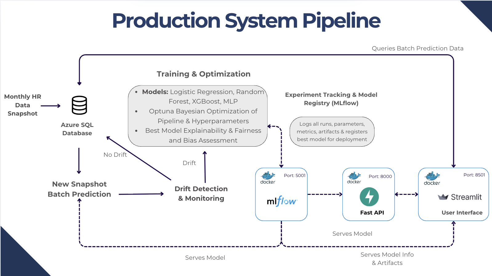
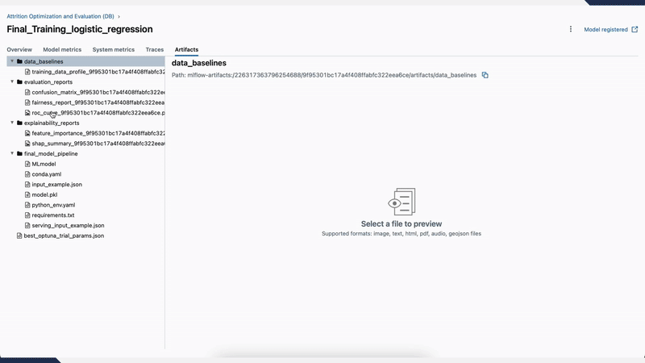
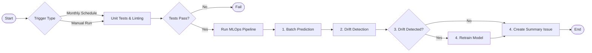

# Employee Attrition MLOps Project

This project implements a full-stack, production-grade MLOps system to predict employee attrition. It automates the entire machine learning lifecycle—from data processing and model training to deployment, monitoring, and automated retraining—while incorporating principles of Responsible AI.



-----

## Key Features

  * **End-to-End Automation**: The MLOps workflow is fully automated using **GitHub Actions**, including model training with hyperparameter optimization (Optuna), validation, deployment, and scheduled monitoring.
  * **Advanced Drift Detection**: A robust system using **Evidently** continuously monitors for both feature drift and prediction drift. Results are logged to **MLflow** and visualized in a dedicated report.
  * **Interactive Frontend**: A **Streamlit** dashboard provides a user-friendly interface for stakeholders to get live predictions, view model performance metrics, and monitor drift status.
  * **Robust Backend & Database Integration**:
      * A high-performance **FastAPI** application serves model predictions and exposes endpoints for health checks and model information.
      * An **SQL Database** is fully integrated to act as the central source for training data, store all batch and real-time predictions, and power the workforce overview dashboard.
  * **Experiment Tracking & Governance**: **MLflow** is used for comprehensive experiment tracking, model versioning, artifact storage (e.g., fairness reports, SHAP plots), and managing the model registry (Staging/Production).
  * **Responsible AI**: Fairness assessment with **Fairlearn** and model explainability using **SHAP** are integrated into the training pipeline to ensure transparency and mitigate bias.
  * **Containerized Deployment**: The entire application stack (API, Frontend, MLflow) is containerized with **Docker** and orchestrated with **Docker Compose** for consistent, reproducible, and scalable deployments.



-----

## CI/CD Automation with GitHub Actions

The core of the project's automation is a **CI/CD pipeline** managed by GitHub Actions. This pipeline handles everything from code validation to the monthly production monitoring and retraining cycle.



The workflow performs the following steps automatically:

1.  **Code Validation**: On every push or pull request, the pipeline runs unit tests and linting to ensure code quality.
2.  **Batch Prediction**: On a monthly schedule, it runs a batch prediction job on the latest employee data.
3.  **Drift Detection**: It compares the new data and predictions against a stored baseline to detect feature and prediction drift.
4.  **Automated Retraining**: If significant drift is detected, the workflow automatically triggers the training pipeline to create a new model candidate.
5.  **Reporting**: A GitHub issue is automatically created after each run to summarize the drift check results and any actions taken.

-----

## Technical Stack 🛠️

This project leverages a modern, robust stack of tools and libraries to build a reliable, end-to-end MLOps solution.

| Category | Technology | Purpose |
| :--- | :--- | :--- |
| 🧪 **ML & Responsible AI** | **Scikit-learn**, **Optuna** | Core model training, building pipelines, and hyperparameter optimization. |
| | **Evidently** | Advanced data and model drift detection. |
| | **SHAP** & **Fairlearn** | Model explainability and fairness assessment for Responsible AI. |
| 🌐 **Backend & Frontend** | **FastAPI** | Serving real-time predictions via a high-performance REST API. |
| | **Streamlit** | Building the interactive user interface and monitoring dashboard. |
| 🚀 **Data & MLOps Platform** | **Azure SQL Database** | Central data store for historical employee data and model predictions. |
| | **MLflow** | Experiment tracking, model registry, and artifact storage. |
| | **Docker** & **Docker Compose**| Containerization of all services for consistent, reproducible deployments. |
| | **GitHub Actions** | CI/CD automation for testing, monitoring, and retraining workflows. |
| 📦 **Core Language & Tooling** | **Python 3.11** | The primary programming language for the entire project. |
| | **Poetry** | Dependency management and packaging. |

-----

## Quickstart with Docker 🐳

This is the recommended method for running the project.

### Prerequisites

  * Docker & Docker Compose
  * Git

### Steps

1.  **Clone the Repository**

    ```bash
    git clone https://github.com/richardelchaar/Employee-Attrition-2.git
    cd Employee-Attrition-2
    ```

2.  **Configure Environment**
    Create a `.env` file from the example template and update it with your database credentials.

    ```bash
    cp .env.example .env
    # Edit the .env file with your configuration
    ```

3.  **Build and Run Services**
    This command will build the images and start all services in the background.

    ```bash
    docker-compose up --build -d
    ```

4.  **Access the Services**

      * **Frontend UI**: [http://localhost:8501](https://www.google.com/search?q=http://localhost:8501)
      * **Prediction API Docs**: [http://localhost:8000/docs](https://www.google.com/search?q=http://localhost:8000/docs)
      * **Drift API Docs**: [http://localhost:8001/docs](https://www.google.com/search?q=http://localhost:8001/docs)
      * **MLflow UI**: [http://localhost:5001](https://www.google.com/search?q=http://localhost:5001)

-----

## Project Structure

Of course. Here is the file structure section formatted with comments for your GitHub `README.md`.

-----

## Project Structure

The repository is organized to separate concerns, making the codebase clean, maintainable, and easy to navigate.

```
/
├── .github/workflows/  # CI/CD pipelines (GitHub Actions)
│   └── production_automation.yml # Main workflow for monitoring & retraining
├── docs/               # All project documentation and guides
├── scripts/            # Automation scripts for key MLOps tasks
│   ├── optimize_train_select.py  # Model training, HPO, and evaluation
│   ├── batch_predict.py          # Scheduled batch prediction job
│   ├── save_reference_data.py    # Creates baseline data for drift monitoring
│   └── run_production_automation.py # Orchestrator script called by CI/CD
├── src/                # Main Python source code
│   ├── employee_attrition_mlops/ # Core installable package
│   │   ├── api.py          # FastAPI application for serving predictions
│   │   ├── config.py       # Centralized project configuration
│   │   ├── data_processing.py # Data loading and custom transformers
│   │   └── pipelines.py    # scikit-learn ML pipeline definitions
│   ├── frontend/         # Streamlit user interface code
│   │   └── app.py          # Main script to run the dashboard
│   └── monitoring/       # Drift detection logic
│       └── drift_detection.py # Core functions for calculating drift
├── tests/              # Test suite for all application code
├── mlruns/             # MLflow experiment data (ignored by git)
├── reports/            # Generated output files (e.g., drift reports)
├── .env                # Local environment variables & secrets (ignored by git)
├── .gitignore          # Specifies files and folders for Git to ignore
├── docker-compose.yml  # Orchestrates all services for local deployment
├── Dockerfile          # Recipe for building the main application's Docker image
└── pyproject.toml      # Project dependencies and metadata (Poetry)
```

-----

## Documentation

For more in-depth information, please refer to the comprehensive documentation.

  * **Core Concepts**
      * [System Architecture](docs/architecture.md)
      * [MLOps Workflow Guide](docs/mlops_workflow_guide.md)
      * [CI/CD Workflow](docs/ci_cd_workflow.md)
  * **Guides & Usage**
      * [Getting Started](docs/getting_started.md)
      * [Detailed Setup Guide](docs/setup_details.md)
      * [MLflow Usage](docs/mlflow_usage.md)
  * **Key Features**
      * [Monitoring & Governance Strategy](docs/monitoring.md)
      * [Drift Detection Guide](docs/drift_detection_guide.md)
      * [Responsible AI Guide](docs/responsible_ai.md)
  * **Reference**
      * [API Documentation](docs/api_documentation.md)
      * [Troubleshooting Guide](docs/troubleshooting.md)

-----

## License

This project is licensed under the MIT License.
