# Architecture Documentation

This document provides detailed architectural diagrams and explanations for the Employee Attrition MLOps project.

## System Overview

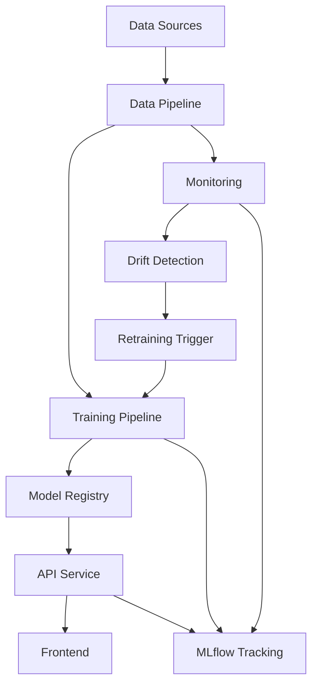

The system follows a standard MLOps architecture with the following key components:
- Data Pipeline: Handles data ingestion and preprocessing
- Training Pipeline: Manages model development and validation
- Model Registry: Stores and versions models
- API Service: Serves predictions
- Frontend: Provides user interface
- Monitoring: Tracks system health and model performance
- MLflow: Centralizes experiment tracking and artifacts

## End-to-End Workflow

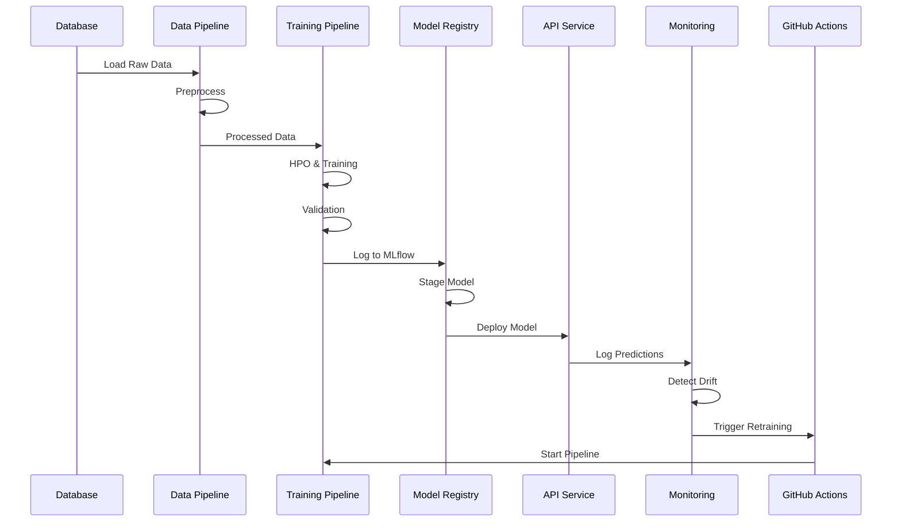

The workflow follows these steps:
1. Data ingestion from database
2. Preprocessing and validation
3. Hyperparameter optimization and training
4. Model validation and logging to MLflow
5. Staging and deployment
6. Monitoring and drift detection
7. Automated retraining via GitHub Actions

## Training Pipeline

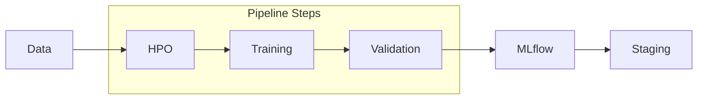

The training pipeline (`optimize_train_select.py`) includes:
1. Hyperparameter Optimization
   - Bayesian optimization
   - Cross-validation
   - Performance metrics
2. Model Training
   - Best hyperparameters
   - Full training set
   - Model serialization
3. Validation
   - Holdout set evaluation
   - Fairness assessment
   - Performance metrics
4. MLflow Integration
   - Parameter logging
   - Metric tracking
   - Artifact storage
5. Staging
   - Model registration
   - Version control
   - Quality checks

## Deployment Architecture

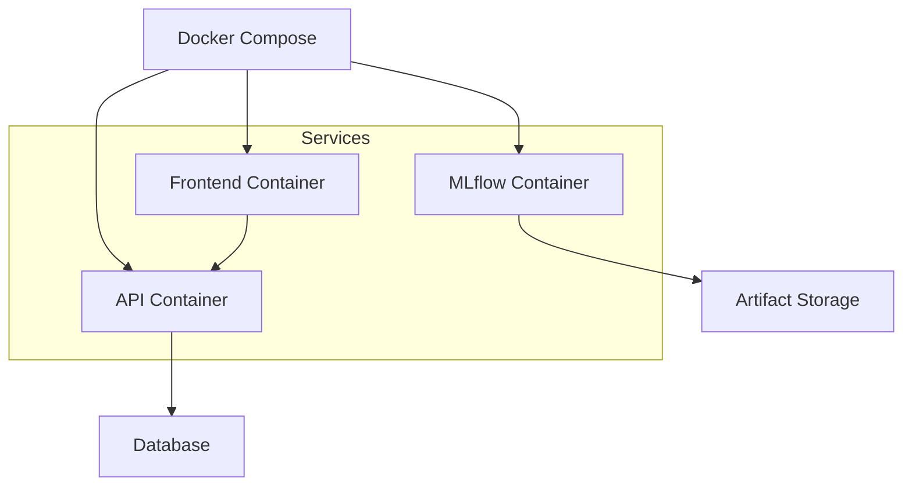

The deployment architecture:
1. Uses Docker Compose for orchestration
2. Runs separate containers for each service
3. Connects to external databases
4. Manages artifact storage
5. Handles service communication

## Monitoring Loop

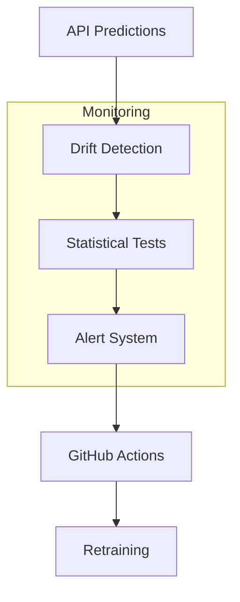

The monitoring loop:
1. Collects prediction data
2. Performs drift detection
3. Runs statistical tests
4. Generates alerts
5. Triggers retraining via GitHub Actions
6. Updates model in production

## CI/CD Pipeline

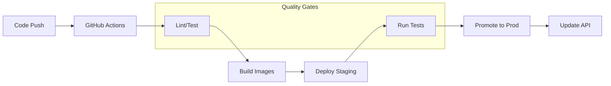

The CI/CD pipeline includes:
1. Code push triggers GitHub Actions
2. Linting and testing
3. Docker image building
4. Staging deployment
5. Integration testing
6. Production promotion
7. API update

Quality gates ensure:
- Code quality standards
- Test coverage requirements
- Performance benchmarks
- Security checks

## API Architecture

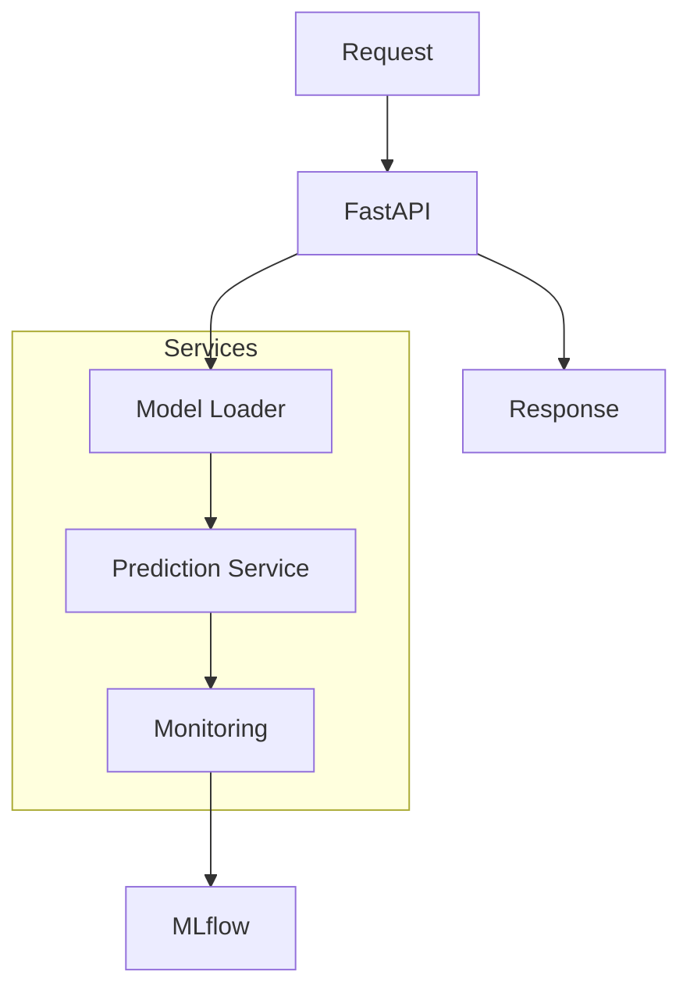

The API architecture includes:
- FastAPI application server
- Model loading service
- Prediction service
- Monitoring integration
- MLflow tracking

## Monitoring Architecture

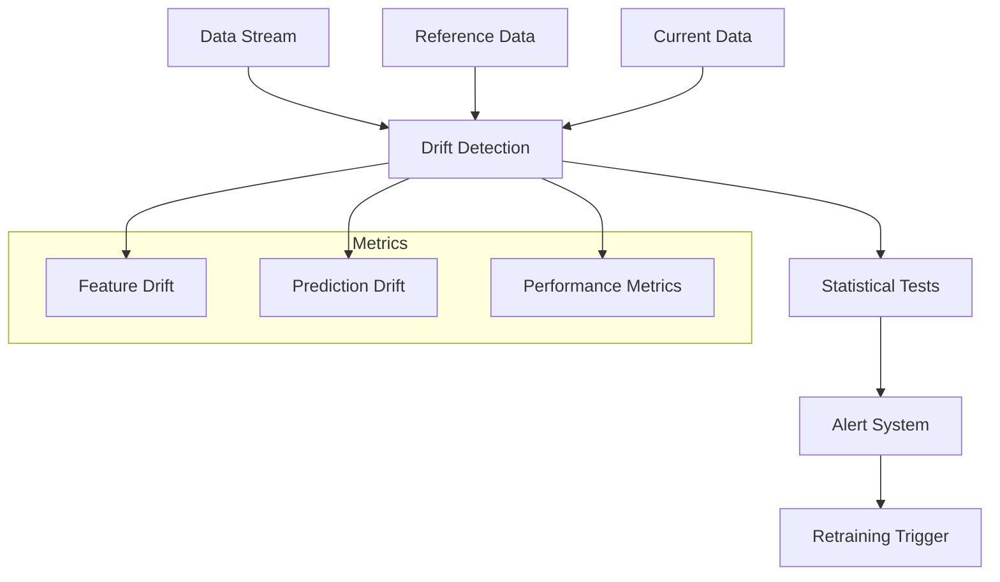

The monitoring system:
1. Compares current data to reference data
2. Performs statistical tests for drift
3. Generates alerts when thresholds are exceeded
4. Triggers retraining when necessary
5. Tracks multiple metrics types

## Artifact Flow

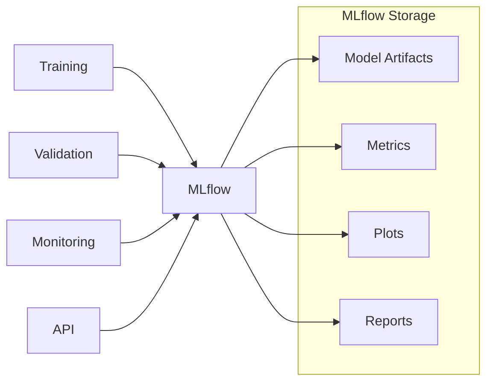

Artifacts are stored in MLflow:
- Model files and configurations
- Training and validation metrics
- Performance plots and visualizations
- Monitoring reports
- API usage statistics

## Security Architecture

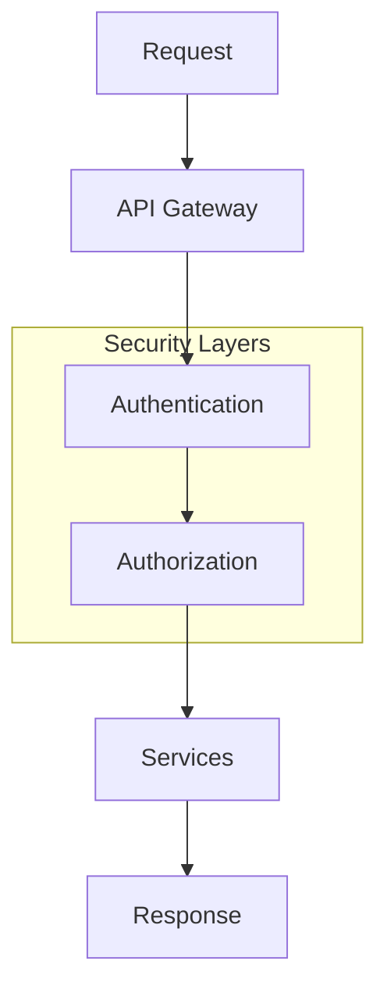

Security measures include:
- API gateway for request routing
- Authentication service
- Authorization checks
- Secure service communication
- Data encryption

## Scaling Architecture

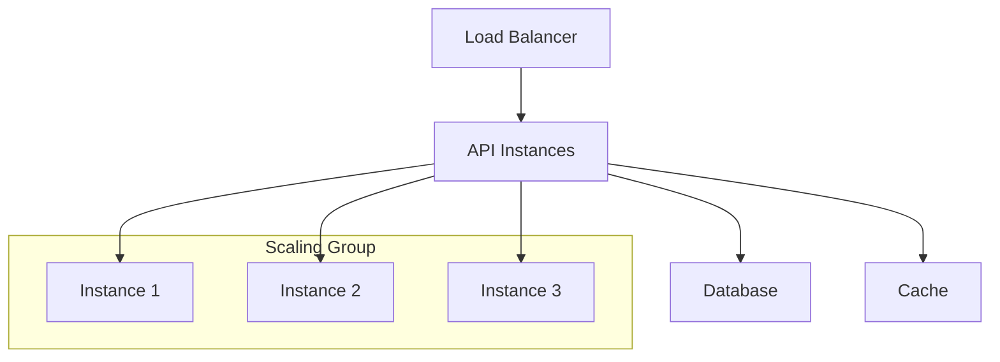

Scaling considerations:
- Load balancing for API instances
- Database connection pooling
- Caching for performance
- Horizontal scaling capability
- Resource monitoring 