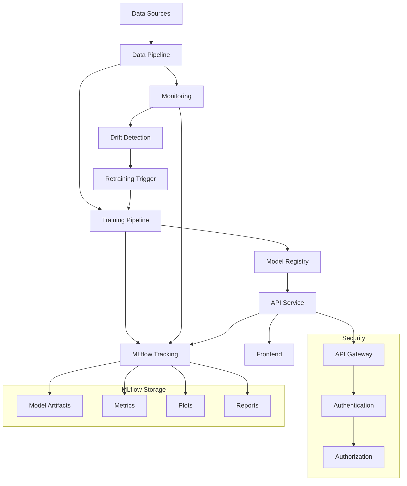
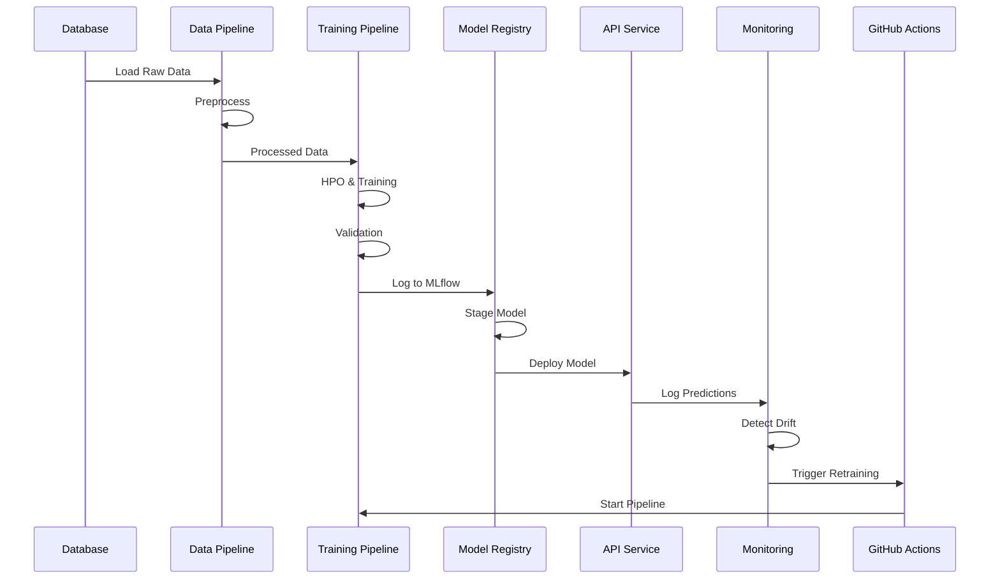
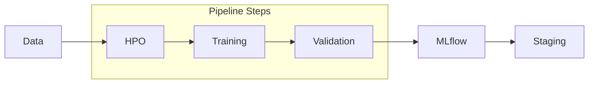
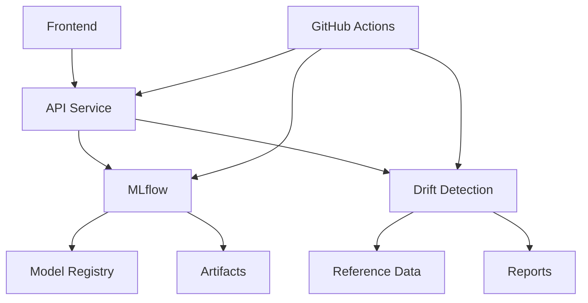
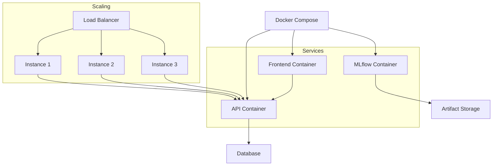
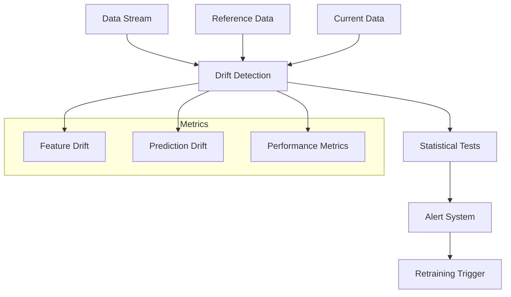
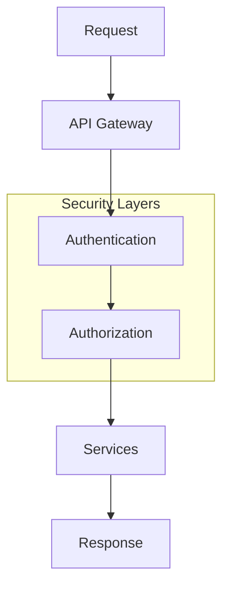

# System Architecture

This document describes the architecture of the Employee Attrition MLOps system.

## System Overview

The system follows a standard MLOps architecture with the following key components:
- Data Pipeline: Handles data ingestion and preprocessing
- Training Pipeline: Manages model development and validation
- Model Registry: Stores and versions models
- API Service: Serves predictions
- Frontend: Provides user interface
- Monitoring: Tracks system health and model performance
- MLflow: Centralizes experiment tracking and artifacts
- Security: API gateway, authentication, and authorization layers

## System Components

### 1. Core Components

#### API Service (`src/employee_attrition_mlops/`)
- FastAPI-based prediction service
- Model serving and inference
- Health monitoring endpoints
- Drift detection API integration
- Database connectivity for predictions

#### Frontend (`src/frontend/`)
- Streamlit-based user interface
- Real-time predictions
- Model information display
- Drift detection reports viewer
- Workforce overview dashboard

#### Monitoring (`src/monitoring/`)
- Drift detection implementation
- Performance monitoring
- Alert generation
- Statistical testing
- Reference data management

#### Utilities (`src/utils/`)
- Common utility functions
- Data processing helpers
- Logging utilities
- Testing helpers
- Database utilities

#### Configuration (`src/config/`)
- Environment configuration
- Database settings
- MLflow configuration
- API settings
- Drift detection parameters

### 2. Infrastructure Components

#### Docker Services
- Main API service (`Dockerfile`)
- Frontend service (`Dockerfile.frontend`)
- Drift detection service (`Dockerfile.drift`)
- MLflow server (`Dockerfile.mlflow`)

#### MLflow Integration
- Experiment tracking (`mlruns/`)
- Model artifacts (`mlartifacts/`)
- Model registry
- Metric tracking
- Drift detection metrics

#### Reference Data
- Baseline data (`reference_data/`)
- Reference predictions (`reference_predictions/`)
- Drift detection reports (`reports/`)
- Model artifacts (`mlartifacts/`)

### 3. Automation Components

#### GitHub Actions
- Production automation
- Drift detection scheduling
- Model promotion
- Testing and validation
- MLflow metadata maintenance

#### Logging
- Production logs (`production_automation.log`)
- Test logs (`test_production_automation.log`)
- MLflow tracking
- Application logs
- Drift detection logs

## End-to-End Workflow

The workflow follows these steps:
1. Data ingestion from database
2. Preprocessing and validation
3. Hyperparameter optimization and training
4. Model validation and logging to MLflow
5. Staging and deployment
6. Monitoring and drift detection
7. Automated retraining via GitHub Actions

## Training Pipeline

The training pipeline includes:
1. Hyperparameter Optimization
   - Bayesian optimization
   - Cross-validation
   - Performance metrics
2. Model Training
   - Best hyperparameters
   - Full training set
   - Model serialization
3. Validation
   - Holdout set evaluation
   - Fairness assessment
   - Performance metrics
4. MLflow Integration
   - Parameter logging
   - Metric tracking
   - Artifact storage
5. Staging
   - Model registration
   - Version control
   - Quality checks

## System Architecture Diagram

## Deployment Architecture

The deployment architecture:
1. Uses Docker Compose for orchestration
2. Runs separate containers for each service
3. Connects to external databases
4. Manages artifact storage
5. Handles service communication
6. Supports horizontal scaling with load balancing

## Monitoring Architecture

The monitoring system:
1. Compares current data to reference data
2. Performs statistical tests for drift
3. Generates alerts when thresholds are exceeded
4. Triggers retraining when necessary
5. Tracks multiple metrics types

## Data Flow

1. **Prediction Flow**
   - Frontend request → API Service
   - API Service → Model Registry
   - Model Registry → Inference
   - Results → Frontend
   - Predictions → Database logging

2. **Monitoring Flow**
   - Scheduled check → Drift Detection
   - Drift Detection → Reference Data
   - Results → MLflow
   - Alerts → GitHub Issues
   - Reports → Frontend display

3. **Training Flow**
   - Data → Preprocessing
   - Preprocessing → Training
   - Training → MLflow
   - MLflow → Model Registry
   - Model Registry → API Service

## Component Interactions

### API Service
- Serves predictions
- Manages model versions
- Handles drift detection requests
- Provides health monitoring
- Logs predictions to database

### Frontend
- Displays predictions
- Shows model information
- Visualizes drift reports
- Provides user interface
- Workforce overview dashboard

### Drift Detection
- Monitors data drift
- Generates reports
- Updates MLflow metrics
- Triggers alerts
- Manages reference data

### MLflow
- Tracks experiments
- Stores artifacts
- Manages model versions
- Records metrics
- Maintains drift history

## Security Architecture

Security measures include:
- API gateway for request routing
- Authentication service
- Authorization checks
- Secure service communication
- Data encryption

## Security Considerations

1. **API Security**
   - Authentication
   - Rate limiting
   - Input validation
   - Error handling
   - Database security

2. **Data Security**
   - Secure storage
   - Access control
   - Data encryption
   - Audit logging
   - Environment variables

3. **Model Security**
   - Version control
   - Access management
   - Validation checks
   - Monitoring
   - Artifact protection

## Scalability

1. **Horizontal Scaling**
   - Docker containerization
   - Load balancing
   - Stateless design
   - Resource management
   - Database connection pooling

2. **Vertical Scaling**
   - Resource optimization
   - Performance tuning
   - Caching strategies
   - Database optimization
   - Memory management

## Monitoring and Maintenance

1. **System Monitoring**
   - Health checks
   - Performance metrics
   - Resource usage
   - Error tracking
   - Database monitoring

2. **Model Monitoring**
   - Drift detection
   - Performance tracking
   - Data quality
   - Prediction monitoring
   - Fairness metrics

3. **Maintenance**
   - Regular updates
   - Backup procedures
   - Cleanup tasks
   - Documentation updates
   - MLflow maintenance 