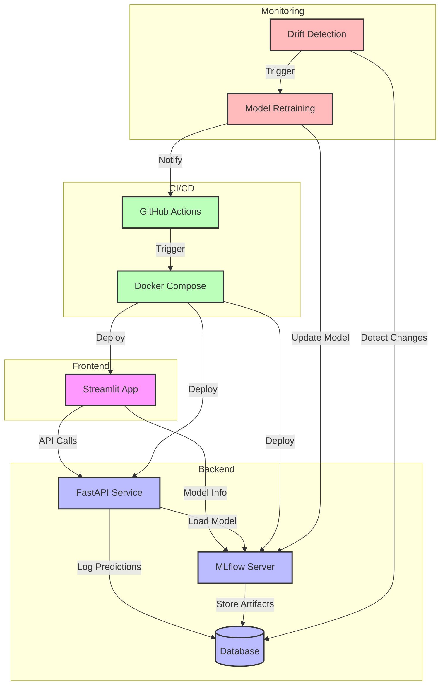
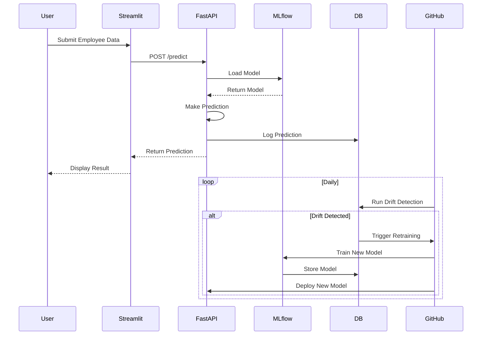

# System Architecture

## Component Diagram



## Data Flow



## Deployment Architecture

```mermaid
graph TB
    subgraph Docker Containers
        direction TB
        FastAPI[FastAPI Container]
        MLflow[MLflow Container]
        Streamlit[Streamlit Container]
    end

    subgraph External Services
        GitHub[GitHub Actions]
        DB[(Database)]
    end

    subgraph Volumes
        MLruns[MLruns Volume]
        MLartifacts[MLartifacts Volume]
    end

    %% Container Connections
    FastAPI -->|Load Model| MLflow
    FastAPI -->|Log Data| DB
    Streamlit -->|API Calls| FastAPI
    Streamlit -->|Model Info| MLflow

    %% Volume Mounts
    MLflow -->|Store Runs| MLruns
    MLflow -->|Store Artifacts| MLartifacts

    %% External Connections
    GitHub -->|Deploy| Docker Containers

    %% Styling
    classDef container fill:#bbf,stroke:#333,stroke-width:2px
    classDef external fill:#fbb,stroke:#333,stroke-width:2px
    classDef volume fill:#bfb,stroke:#333,stroke-width:2px

    class FastAPI,MLflow,Streamlit container
    class GitHub,DB external
    class MLruns,MLartifacts volume
```

## Component Descriptions

### Frontend (Streamlit)
- Interactive web interface for predictions
- Real-time model information display
- User-friendly forms for data input

### Backend (FastAPI)
- RESTful API for predictions
- Model loading and inference
- Prediction logging
- Health checks

### MLflow Server
- Model versioning and tracking
- Experiment management
- Artifact storage
- Model registry

### Database
- Stores historical data
- Logs predictions
- Tracks model performance

### CI/CD Pipeline
- Automated testing
- Drift detection
- Model retraining
- Deployment automation

### Monitoring
- Data drift detection
- Model performance monitoring
- Automated retraining triggers
- Health checks 