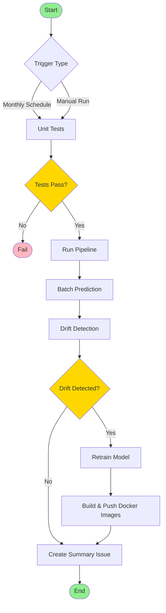

# CI/CD Workflow Documentation

This document describes the CI/CD workflow for the Employee Attrition project.

## Workflow Overview

The CI/CD pipeline is designed to run monthly checks for model drift and automatically retrain the model when necessary. It consists of three main jobs: unit testing, pipeline execution, and Docker image building.

## Workflow Diagram

## Workflow Components

### 1. Triggers
- **Monthly Schedule**: Runs at midnight on the first day of every month
- **Manual Trigger**: Can be triggered manually through GitHub Actions

### 2. Unit Test Job
- Installs project dependencies
- Runs pytest for unit tests
- Performs code linting (black, isort, flake8, mypy)

### 3. Pipeline Job
- Sets up the environment with necessary secrets
- Runs Docker Compose for service orchestration
- Executes batch prediction
- Checks for feature and prediction drift
- Retrains model if drift is detected
- Creates a summary issue with results

### 4. Docker Build Job (Conditional)
- Only runs if drift is detected
- Builds and pushes four Docker images:
  - MLflow server
  - API service
  - Frontend application
  - Drift detection API

## Output and Monitoring

The workflow creates a GitHub issue after each run with:
- Feature drift results
- Prediction drift results
- Retraining status
- Batch prediction summary
- Link to the workflow run

## Security

The workflow uses GitHub secrets for sensitive information:
- MLflow tracking URI
- Database connection strings
- DockerHub credentials
- Drift API URL 