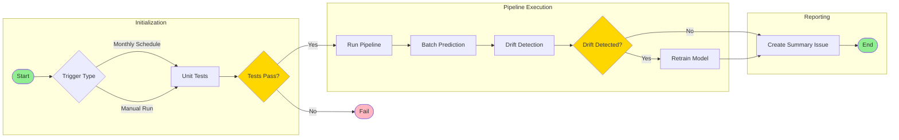

# CI/CD Workflow

This document describes the Continuous Integration and Continuous Deployment (CI/CD) pipeline for the Employee Attrition MLOps project.

## Workflow Overview

The CI/CD pipeline is designed to run monthly checks for model drift and automatically retrain the model when necessary. It consists of two main jobs: unit testing and pipeline execution.

## Workflow Diagram



## Monthly MLOps Pipeline

### Schedule
- Runs automatically at midnight UTC on the first day of every month
- Can be triggered manually through GitHub Actions

### Workflow Steps

1. **Unit Testing and Linting**
   ```yaml
   - Run pytest for all test cases
   - Perform code linting:
     - black
     - isort
     - flake8
     - mypy
   ```

2. **Pipeline Execution**
   ```yaml
   - Build and run services with Docker Compose
   - Execute batch prediction
   - Perform drift detection
   - Trigger retraining if needed
   ```

3. **Drift Detection**
   ```yaml
   - Check feature drift via API
   - Check prediction drift via API
   - Generate drift reports
   - Create GitHub issue with results
   ```

4. **Model Retraining**
   ```yaml
   - Triggered if feature OR prediction drift is detected
   - Run hyperparameter optimization
   - Train new model
   - Save new reference data
   ```

### Environment Variables
The workflow requires the following environment variables:
- `MLFLOW_TRACKING_URI`: MLflow server URL
- `DATABASE_URL_PYMSSQL`: Database connection string (PyMSSQL)
- `DATABASE_URL_PYODBC`: Database connection string (PyODBC)
- `DRIFT_API_URL`: Drift detection API URL
- `DOCKER_USERNAME`: Docker Hub username

### Output Files
The workflow generates the following files:
- `reports/batch_predictions.json`: Batch prediction results
- `reports/batch_features.json`: Feature data for drift detection
- `reports/feature_drift_results.json`: Feature drift detection results
- `reports/prediction_drift_results.json`: Prediction drift detection results

### GitHub Issue Summary
After each run, a GitHub issue is created with:
- Workflow status
- Feature drift results
- Prediction drift results
- Retraining status
- Batch prediction summary

## Manual Triggering

1. Go to the "Actions" tab in the repository
2. Select "Monthly MLOps Pipeline"
3. Click "Run workflow"

## Troubleshooting

### Common Issues
1. **Docker Compose Failure**
   - Check Docker service status
   - Verify Docker Compose file
   - Check for port conflicts

2. **Batch Prediction Failure**
   - Verify input data availability
   - Check model availability
   - Review prediction script logs

3. **Drift Detection Failure**
   - Verify API endpoint availability
   - Check reference data existence
   - Review drift detection logs

4. **Retraining Failure**
   - Check training data availability
   - Verify hyperparameter configuration
   - Review training logs

### Debugging Steps
1. Check GitHub Actions logs
2. Review MLflow tracking
3. Verify environment variables
4. Test API endpoints
5. Check Docker container logs

## Best Practices

### Development
- Write comprehensive tests
- Follow code style guidelines
- Document all changes
- Use type hints

### Deployment
- Test locally before pushing
- Monitor workflow execution
- Review drift reports
- Document model changes

### Monitoring
- Regular drift checks
- Performance tracking
- Error monitoring
- Resource usage monitoring 