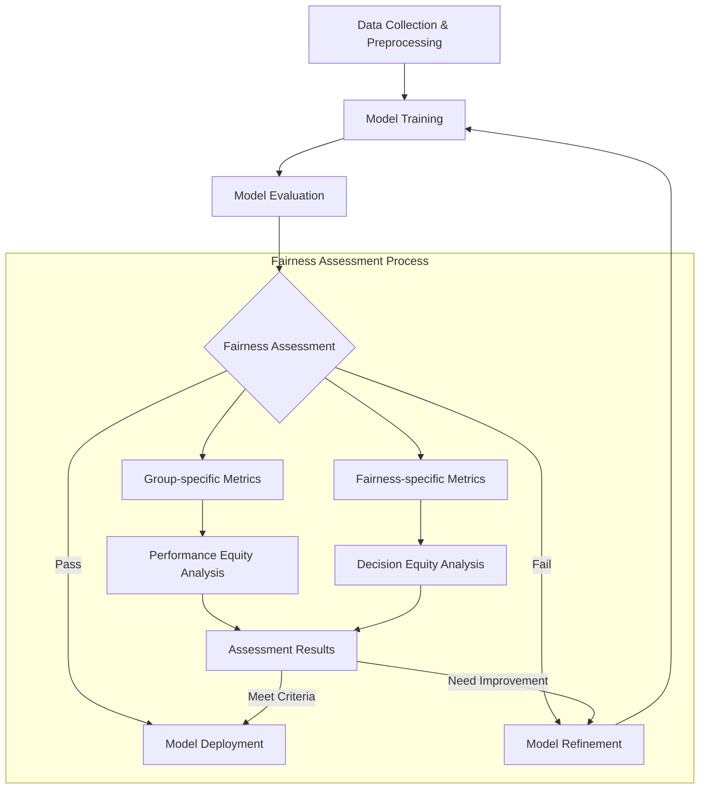
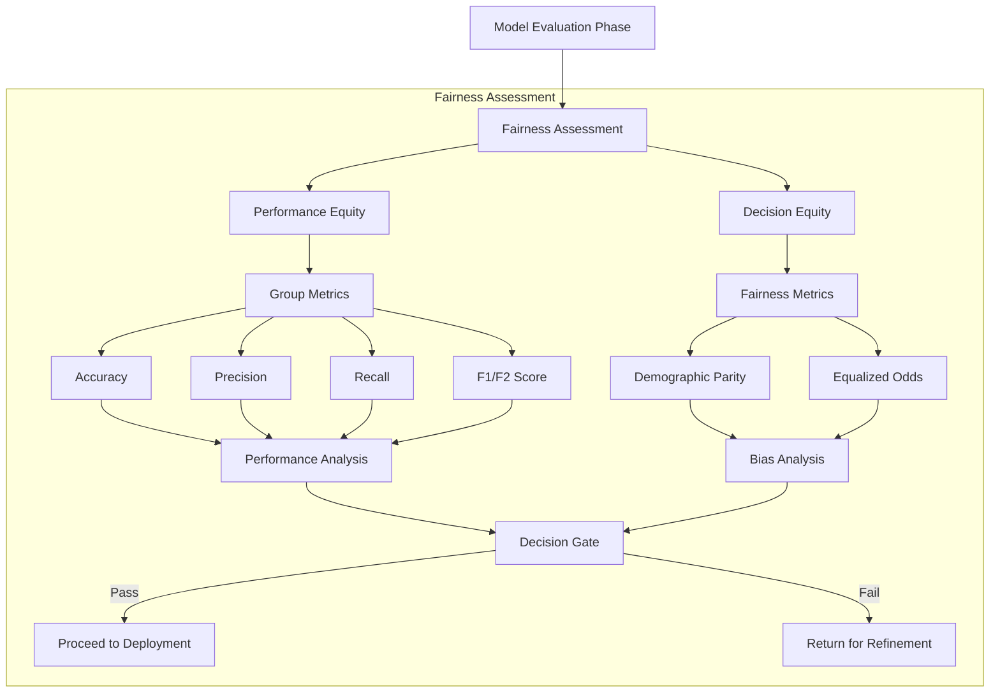

# Fairness Assessment Pipeline



Or the detailed version:


```

2. You can place this file in:
   - A new `docs` directory in your project root: `/docs/fairness_assessment_diagram.md`
   - Or in your existing documentation directory if you have one

3. You can then reference this diagram in your slides or documentation.

The Mermaid diagrams will render in environments that support Mermaid markdown (like GitHub, GitLab, or many markdown viewers). If you're using a different presentation format, you can use tools like the Mermaid Live Editor (https://mermaid.live) to export the diagrams as images.

Would you like me to suggest alternative locations or formats for the diagram?